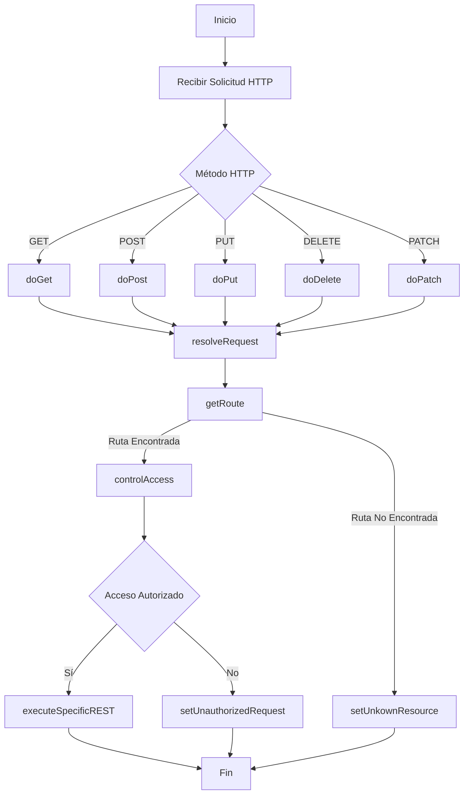

# GenericApexRest

La intencion del repositorio es brindar un punto unico de entrada a los distintos servicios REST personalizados. Brinda la posibilidad de poder parametrizar los servicios REST a traves de  distintos registros de Metadatos y la posibilidad de gestionar el acceso a los mismos en base a una Configuracion Personalizada, brindando flexibilidad, seguridad y escalabilidad a la hora de exponer servicios.

Diagrama de flujo

